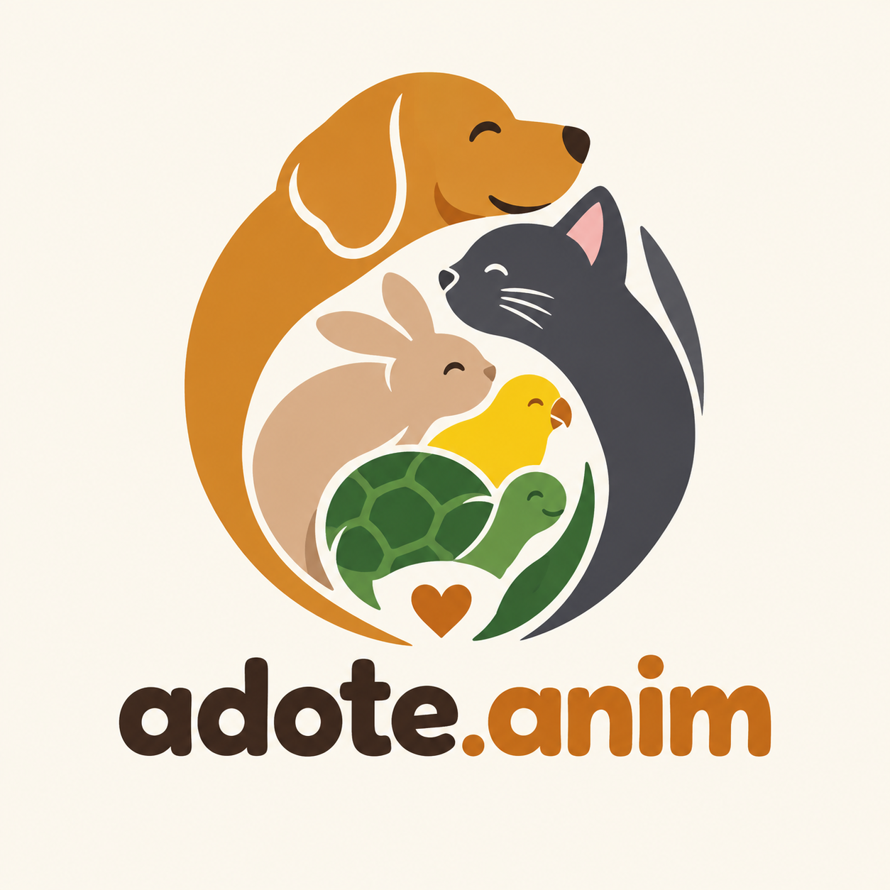

<div align="center">



# **AdoteApp**

**Adoção com informação. Cuidado com propósito.**

Plataforma web para adoção de animais e acompanhamento de vacinas

  

</div>

---

**Instituição:** CEUB · **Curso:** ADS · **Disciplina:** Desenvolvimento Web · **Turma/Semestre:** 2026.02 · **Professor:** Felippe Pires Ferreira

> **Sobre o nome.** O projeto foi planejado com os nomes "PetMatch" e "AdoteApp". O nome final é **adote.anim**. O pacote Django ainda se chama `adote_app`, nome do início do desenvolvimento.

---

## Sumário
1. [Descrição do projeto](#1-descrição-do-projeto)
2. [Funcionalidades](#2-funcionalidades)
3. [Demonstração](#3-demonstração)
4. [Tecnologias utilizadas](#4-tecnologias-utilizadas)
5. [Arquitetura e API](#5-arquitetura-e-api)
6. [Organização dos diretórios](#6-organização-dos-diretórios)
7. [Participantes](#7-participantes)
8. [Como executar](#8-como-executar)
9. [Configuração](#9-configuração)
10. [Testes](#10-testes)
11. [Segurança](#11-segurança)
12. [Uso de inteligência artificial](#12-uso-de-inteligência-artificial)
13. [Contribuição e fluxo de trabalho](#13-contribuição-e-fluxo-de-trabalho)
14. [Histórico de versões](#14-histórico-de-versões)
15. [Limitações e próximos passos](#15-limitações-e-próximos-passos)
16. [Licença, referências e contato](#16-licença-referências-e-contato)

---

## 1. Descrição do projeto
O AdoteApp é uma plataforma web que conecta ONGs e protetores de animais a pessoas que querem adotar, e ajuda quem adotou a organizar a rotina de cuidados do pet. Quem cuida dos animais cadastra os disponíveis, com espécie, raça, porte, idade e CEP. Quem procura um companheiro busca por esses critérios. Depois da adoção, o histórico de vacinas fica registrado, com apoio de preenchimento automático de endereço (ViaCEP) e de importação de raça e foto (Dog API / Cat API).

**Problema:** informações sobre animais para adoção ficam espalhadas em redes sociais e planilhas, e o histórico de saúde do pet se perde depois da adoção.

### Objetivos
- **Objetivo geral:** centralizar o cadastro de animais para adoção e o acompanhamento de vacinas e consultas dos pets adotados.
- **Objetivos específicos:**
  - Permitir que ONGs e protetores cadastrem, editem e removam animais.
  - Permitir o registro e a consulta do histórico de vacinas.
  - Buscar animais por espécie, porte, idade ou localização (CEP).
  - Gerar relatórios de adoções do mês e de vacinas pendentes.
  - Expor uma API REST pública com os animais disponíveis, para sites parceiros.
  - Integrar a ViaCEP e a Dog API / Cat API em fluxos reais do sistema.

### Público-alvo
- ONGs e protetores independentes de animais
- Adotantes e tutores, que precisam encontrar um animal e acompanhar vacinas
- Sites parceiros que querem exibir animais disponíveis via API

Documento completo: [Documento de Visão](docs/Documento%20de%20vis%C3%A3o-1.pdf).

---

## 2. Funcionalidades

| Funcionalidade | Descrição | Status |
|---|---|---|
| Cadastro de animais | Criar, consultar, alterar e excluir (escrita exige login) | Implementada |
| Cadastro de tutores | CRUD com endereço preenchido pelo CEP (ViaCEP); abrigos e ONGs são cadastrados como tutores | Implementada |
| Vacinas | CRUD com validação de datas (a aplicação não pode ser futura; a próxima dose vem depois da aplicação) | Implementada |
| Consultas | Modelo no banco e cadastro pelo painel `/admin/`; sem telas próprias | Parcial |
| Busca de animais | Filtros por espécie, porte, idade e CEP, combináveis, na tela e na API | Implementada |
| Registro de adoção | Campos `tutor` e `data_adocao` no animal | Implementada (modelo simplificado) |
| Relatório de adoções do mês | Filtro por mês; imprimir ou salvar em PDF; exige login | Implementada |
| Calendário de vacinas pendentes | Doses pendentes e atrasadas, agrupadas por mês; imprimir ou salvar em PDF | Implementada |
| API REST própria | `GET /api/animais` (público) e escrita autenticada, com Swagger e Redoc | Implementada |
| Raça e foto (Dog/Cat API) | Lista de raças e foto de referência no formulário do animal | Implementada |
| Identidade visual | Paleta, fonte Inter e logotipo aplicados em todas as telas; layout responsivo e de impressão | Implementada |

### Requisitos não funcionais
- **Desempenho:** consultas paginadas (20 itens por página) e chamadas externas com timeout de 5 segundos.
- **Segurança:** senhas com hash; HTTPS, HSTS, cookies seguros e CSP com `DEBUG=False`; escrita protegida por login; segredos fora do repositório (ver [seção 11](#11-segurança)).
- **Usabilidade:** interface responsiva para computador e celular; relatórios imprimíveis.
- **Disponibilidade:** aplicação publicada em URL pública durante o período de avaliação.

---

## 3. Demonstração

### Telas da aplicação
| Tela | Endereço | Descrição |
|---|---|---|
| Lista e busca de animais | `/animais/` | Cards com foto, raça, porte, idade e CEP; filtros por espécie, porte, idade e CEP |
| Cadastro de animal | `/animais/novo/` | Raça e foto sugeridas pela Dog/Cat API ao escolher a espécie |
| Cadastro de tutor | `/tutores/novo/` | Endereço preenchido automaticamente pela ViaCEP ao digitar o CEP |
| Vacinas | `/saude/vacinas/` | Histórico de vacinas por animal |
| Vacinas pendentes | `/saude/vacinas/pendentes/` | Calendário por mês, com atrasadas destacadas |
| Relatório de adoções | `/animais/relatorio/adocoes/` | Adoções do mês, com impressão |
| Documentação da API | `/api/docs/` e `/api/redoc/` | Swagger e Redoc |

### Protótipos de referência (Figma)
<table>
<tr>
<td></td>
<td></td>
</tr>
<tr>
<td align="center">Encontrar um pet</td>
<td align="center">Cadastro de animal</td>
</tr>
</table>

**Protótipo no Figma:** [adote.anim](https://www.figma.com/design/AH6WseuknkiNPtpfBXwWO6)
**Documentação visual:** [identidade visual](docs/prototipos/identidade-visual/README.md) · [wireframes](docs/prototipos/wireframes/README.md) · [protótipos desktop](docs/prototipos/desktop/README.md) · [protótipos mobile](docs/prototipos/Mobile/README.md)

---

## 4. Tecnologias utilizadas

| Camada | Tecnologia | Versão |
|---|---|---|
| Linguagem | Python | 3.13 (testado também em 3.12) |
| Backend | Django | 6.1.1 |
| API REST | Django REST Framework | 3.18.1 |
| Documentação da API | drf-spectacular (Swagger e Redoc) | 0.30.0 |
| Banco de dados | SQLite (local) · PostgreSQL por `DATABASE_URL` (produção) | — |
| Frontend | Templates Django, HTML e CSS próprio | — |
| Integrações HTTP | requests | 2.34.2 |
| Publicação | gunicorn e WhiteNoise | 26.2.0 · 6.12.0 |
| Testes | Django Test Runner e `unittest.mock` | embutidos |
| Segurança | Bandit, pip-audit e `check --deploy` (SAST) · OWASP ZAP (DAST) | — |
| Ferramentas | Git, VS Code, Postman, Figma | — |
| APIs externas | ViaCEP · The Dog API · The Cat API | — |

---

## 5. Arquitetura e API
Aplicação Django em camadas: apresentação (templates), controle (views e DRF), serviços de integração (`services.py`, com timeout e tratamento de erro), domínio (models) e persistência (ORM). Diagrama e texto: [Arquitetura em Camadas](docs/Arquitetura%20em%20Camadas.pdf).

```text
[Usuário / Site parceiro] → [Templates / API REST] → [Views] → [Models] → [Banco]
                                                       ↓
                                           [ViaCEP]  [Dog API / Cat API]
```

**Decisões relevantes**
- API REST própria (DRF) para sites parceiros consumirem os animais disponíveis, sem expor dados de tutores.
- Banco relacional, pois as entidades (Animal, Tutor, Vacina, Consulta) têm relacionamentos bem definidos.
- A ViaCEP preenche o endereço do tutor no cadastro, e a Dog/Cat API fornece raça e foto no cadastro do animal. Em ambas, o dado é salvo e usado pelo sistema.
- Serviços de integração isolados em `services.py`: falhas viram mensagens claras e o cadastro manual continua possível.

### Endpoints da API pública
| Método | Rota | Acesso | Descrição |
|---|---|---|---|
| GET | `/api/animais` | Público | Animais disponíveis; filtros `especie`, `porte`, `idade`, `cep`; paginação |
| GET | `/api/animais/{id}` | Público | Detalhes de um animal disponível |
| POST | `/api/animais` | Autenticado | Cadastra um animal |
| PUT / PATCH | `/api/animais/{id}` | Autenticado | Atualiza um animal |
| DELETE | `/api/animais/{id}` | Autenticado | Remove um animal |

Documentação: [documentacao-api.md](docs/api/documentacao-api.md) · [OpenAPI](docs/api/openapi.yaml) · [coleção do Postman](docs/api/adote-anim.postman_collection.json) · Swagger: `https://[URL-DA-APLICACAO]/api/docs/` · Redoc: `https://[URL-DA-APLICACAO]/api/redoc/`

Integrações externas: [plano de integração](docs/plano_integração.md).

---

## 6. Organização dos diretórios
```text
.
├── README.md
├── manage.py
├── requirements.txt
├── .env.example          # modelo de variáveis de ambiente (sem segredos)
├── adote_app/            # configurações do projeto Django
├── templates/            # layout base (cabeçalho, menu, rodapé)
├── static/               # CSS da identidade visual e logotipo
├── animais/              # app: animais, busca, API, integração Dog/Cat, relatório de adoções
├── tutores/              # app: tutores e integração ViaCEP
├── saude/                # app: vacinas, consultas e vacinas pendentes
├── docs/
│   ├── Documento de visão-1.pdf
│   ├── Arquitetura em Camadas.pdf
│   ├── plano_integração.md
│   ├── modelagem/        # casos de uso, banco de dados (ER e lógico) e classes
│   ├── prototipos/       # identidade visual, wireframes, desktop e mobile
│   ├── api/              # documentação, OpenAPI e coleção do Postman
│   ├── testes/           # roteiro de testes manuais e evidências
│   ├── seguranca/        # relatório SAST/DAST e evidências brutas
│   ├── planejamento/     # backlog e checklist de coerência
│   └── apresentacao/     # roteiro da apresentação
├── images/               # figuras da documentação
└── fotos_testes/         # capturas das validações das integrações
```
Os testes automatizados ficam em `tests.py` dentro de cada app.

---

## 7. Participantes

| Nome | Função no projeto |
|---|---|
| Bruna Bonifácio | Documentação e Visão |
| Rafael Ramos | Arquitetura e Dados |
| Isadora Fernandes | Design e Identidade visual |
| Ana Clara | Desenvolvimento backend |
| Renata Teixeira de Jesus | Desenvolvimento e integrações (busca, relatórios, APIs externas) |

**Professor responsável:** Felippe Pires Ferreira

---

## 8. Como executar
**Pré-requisitos:** Git e Python 3.13.

```bash
# 1. Clonar
git clone https://github.com/Bruhbs-123/Projeto-web
cd Projeto-web

# 2. Ambiente virtual
python -m venv venv
source venv/bin/activate        # Windows: venv\Scripts\activate

# 3. Dependências
pip install -r requirements.txt

# 4. Variáveis de ambiente
cp .env.example .env            # Windows: copy .env.example .env
# edite o .env (para desenvolvimento local mantenha DEBUG=True)

# 5. Banco de dados e usuário administrador
python manage.py migrate
python manage.py createsuperuser

# 6. Executar
python manage.py runserver
```
**Acesso local:** http://127.0.0.1:8000/ (redireciona para `/animais/`) · Login e administração: http://127.0.0.1:8000/admin/ · Swagger: http://127.0.0.1:8000/api/docs/

### Aplicação publicada
- **URL:** `https://[URL-DA-APLICACAO]`
- **Documentação da API:** `https://[URL-DA-APLICACAO]/api/docs/`
- **Conta de teste:** informada ao professor (credenciais não ficam neste repositório).
- **Como publicar:** em um provedor com suporte a Python (por exemplo, Render), use o comando de build `pip install -r requirements.txt && python manage.py collectstatic --noinput && python manage.py migrate` e o comando de início `gunicorn adote_app.wsgi`. Defina as variáveis da seção 9 no painel do provedor, com `DEBUG=False`.
- **Observação:** em planos gratuitos a aplicação pode "dormir" após inatividade; o primeiro acesso pode levar cerca de 1 minuto.

---

## 9. Configuração
Valores reais ficam só no `.env` (não versionado) ou no painel do provedor. Modelo: [`.env.example`](.env.example).

| Variável | Obrigatória | Descrição |
|---|---|---|
| `SECRET_KEY` | Em produção | Chave secreta do Django; sem ela, com `DEBUG=False`, a aplicação não inicia |
| `DEBUG` | Sim | `True` só em desenvolvimento; o padrão é `False` |
| `ALLOWED_HOSTS` | Em produção | Hosts permitidos, separados por vírgula |
| `CSRF_TRUSTED_ORIGINS` | Em produção | Origens HTTPS confiáveis, por exemplo `https://meu-app.onrender.com` |
| `DATABASE_URL` | Em produção | Conexão do banco; vazia usa SQLite local |
| `DOG_API_KEY` | Recomendada | Chave da The Dog API |
| `CAT_API_KEY` | Recomendada | Chave da The Cat API |

---

## 10. Testes
```bash
python manage.py test
```
**Resultado atual:** 58 testes automatizados, todos passando ([saída completa](docs/seguranca/evidencias/testes-automatizados.txt)). Cobertura percentual: não medida.

| Tipo | Ferramenta | O que verifica |
|---|---|---|
| Unitários | Django Test Runner, `unittest.mock` | Validação de vacinas, ViaCEP e Dog/Cat API (timeout, 401, 429, resposta inválida) |
| Integração | Django Test Client | API (filtros, 400/403/404, paginação), busca, controle de acesso, relatórios, cabeçalhos de segurança |
| API | Postman (Newman) | 15 requisições e 24 verificações, 0 falhas ([evidência](docs/testes/evidencias/postman-newman-local.txt)) |
| Manuais | [Roteiro de testes](docs/testes/roteiro-testes-manuais.md) | Cadastro, busca, relatórios, integrações, API e responsividade |

---

## 11. Segurança
Foram executados SAST (Bandit, pip-audit e `check --deploy`) e DAST (OWASP ZAP 2.16.1) contra a própria aplicação. Em resumo:

| | Antes | Depois |
|---|---|---|
| Bandit | 1 achado baixo | 0 |
| pip-audit | 0 vulnerabilidades | 0 |
| `check --deploy` | 1 erro e 7 avisos | 1 aviso (aceito) |
| OWASP ZAP | 0 alto · 2 médios · 2 baixos | 0 alto · 2 médios e 1 baixo (só do Swagger, aceitos) |

Evidências, interpretação dos achados, correções, riscos aceitos e limites da análise: [relatório de segurança](docs/seguranca/relatorio-seguranca.md).

---

## 12. Uso de inteligência artificial
Este repositório segue a política de uso de IA da disciplina (semáforo pedagógico):


| Situação | Significado |
|---|---|
| **Vermelho: uso proibido** | Atividades de autonomia intelectual (ex.: provas presenciais sem consulta). |
| **Amarelo: uso limitado** | IA pode ser ferramenta auxiliar, desde que haja declaração de uso. |
| **Verde: uso permitido** | Uso livre ao longo da atividade acadêmica. |

### Declaração de uso
- **Houve uso de IA neste projeto?** Sim.
- **Ferramentas utilizadas:** Claude, Gemini e Figma (conforme declarado pelo grupo).
- **Finalidade:**
  - **Claude:** apoio na documentação final (README, documentação da API, relatório de segurança, roteiro de testes, backlog, checklist de coerência); implementação da API REST, da busca, do controle de acesso, das configurações de segurança e da aplicação do layout com a identidade visual; execução e interpretação das análises SAST e DAST.
  - **Gemini:** apoio de pesquisa e dúvidas durante o desenvolvimento.
  - **Figma:** criação dos protótipos e da identidade visual.
- **O que não foi delegado à IA:** a escolha do tema e do problema, a divisão de tarefas, os protótipos e a identidade visual definidos pela equipe, a revisão e a aprovação final do conteúdo entregue.

> Cada integrante é responsável por conferir que esta declaração reflete o seu próprio uso. O enunciado da disciplina pede que a especificação (visão, casos de uso, arquitetura) seja de autoria individual.

---

## 13. Contribuição e fluxo de trabalho
- `main`: versão estável para avaliação.
- `feat/...`, `fix/...`, `docs/...`: ramos de trabalho, integrados por pull request.
- Commits curtos, no imperativo: `feat: adiciona busca por CEP`, `fix: corrige validação de data`, `docs: atualiza o README`.
- Cada integrante faz commits na própria conta.

**Tarefas e planejamento:** [backlog](docs/planejamento/backlog.md) · [checklist de coerência](docs/planejamento/checklist-coerencia.md)

---

## 14. Histórico de versões

| Versão | Data | Descrição |
|---|---|---|
| 0.1.0 | 23/09/2026 | Estrutura inicial do repositório e Documento de Visão (Fase 1) |
| 1.0.0 | 05/10/2026 | Entrega final: CRUD, busca, relatórios, API REST, integrações, identidade visual, segurança e documentação |

---

## 15. Limitações e próximos passos

### Problemas conhecidos
- O modelo de dados implementado é mais simples que o DER: não há entidades `Abrigo` e `Adoção` separadas. Abrigos são tratados como tutores, e a adoção é registrada no próprio animal (tutor e data).
- `Consulta` existe no banco e no painel `/admin/`, mas não tem telas próprias.
- A busca por CEP compara o CEP cadastrado no animal (correspondência exata); não calcula proximidade.
- Por segurança (CSP), as fotos só carregam dos CDNs da Dog/Cat API; uma foto de outro domínio mostra um ícone no lugar.
- A documentação interativa (Swagger e Redoc) usa uma CDN externa e tem uma política de segurança mais branda, registrada como risco aceito.
- O DAST foi executado em instância local; a repetição na URL publicada consta no relatório de segurança.
- As páginas "Home", "Sobre" e "Como funciona" dos protótipos ainda não existem no Django.

### Roadmap
- [x] CRUD de animais, tutores e vacinas
- [x] Busca por espécie, porte, idade e CEP
- [x] API REST própria (`GET /api/animais`) com documentação
- [x] Integração ViaCEP no cadastro de tutores
- [x] Integração Dog API / Cat API no cadastro de animais
- [x] Relatórios de adoções e de vacinas pendentes
- [x] Autenticação para as telas de escrita
- [x] Análises SAST e DAST documentadas
- [x] Identidade visual aplicada às telas
- [ ] Publicação com HTTPS na URL final (ver seção 8)
- [ ] Telas de consultas, página inicial, "Sobre" e "Como funciona"
- [ ] Busca por proximidade usando a ViaCEP
- [ ] Cadastro público de usuários e notificações de vacinas por e-mail

---

## 16. Licença, referências e contato
**Licença:** uso exclusivamente acadêmico. Este material destina-se a fins educacionais.

### Documentação complementar
- [Documento de Visão](docs/Documento%20de%20vis%C3%A3o-1.pdf)
- [Casos de uso](docs/modelagem/casos-de-uso/)
- [Arquitetura em camadas](docs/Arquitetura%20em%20Camadas.pdf)
- [Modelo de dados (ER e lógico)](docs/modelagem/banco-de-dados/) e [diagrama de classes](docs/modelagem/classes/)
- [Contrato e documentação da API](docs/api/documentacao-api.md) · [plano de integração externa](docs/plano_integração.md)
- [Identidade visual](docs/prototipos/identidade-visual/README.md) · [wireframes](docs/prototipos/wireframes/README.md) · [protótipos desktop](docs/prototipos/desktop/README.md) · [protótipos mobile](docs/prototipos/Mobile/README.md)
- [Roteiro de testes](docs/testes/roteiro-testes-manuais.md) · [relatório de segurança](docs/seguranca/relatorio-seguranca.md)

### Referências
- Django: https://docs.djangoproject.com
- Django REST Framework: https://www.django-rest-framework.org · drf-spectacular: https://drf-spectacular.readthedocs.io
- ViaCEP: https://viacep.com.br · The Dog API: https://www.thedogapi.com · The Cat API: https://www.thecatapi.com
- OWASP ZAP: https://www.zaproxy.org · Bandit: https://bandit.readthedocs.io · pip-audit: https://pypi.org/project/pip-audit/
- Figma: https://www.figma.com

### Contato
Dúvidas sobre o projeto: abra uma *issue* em https://github.com/Bruhbs-123/Projeto-web/issues.

**Agradecimentos:** Professor Felippe Pires Ferreira.
